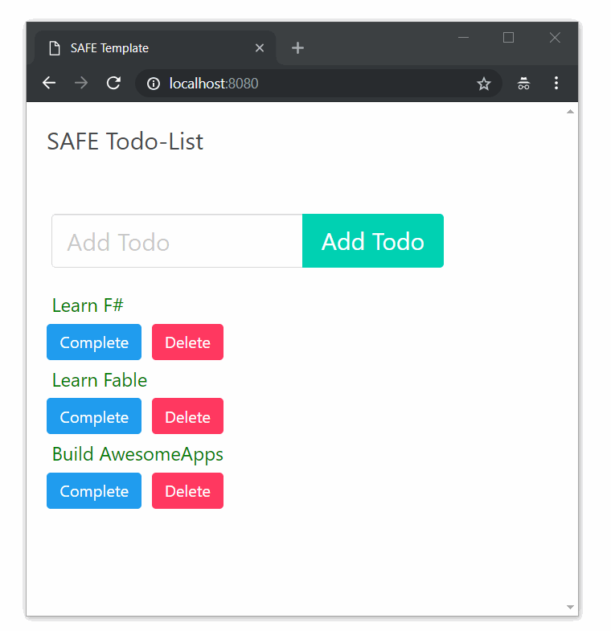

# SAFE-TodoList

The simplest Todo app showcasing a client-server application written entirely in F# using:
 - [Fable](https://github.com/fable-compiler/Fable) for compiling F# code to javascript
 - [Elmish](https://github.com/fable-elmish/elmish) for Elm-style single page apps
 - [Suave](https://github.com/SuaveIO/suave) as the web server
 - [Fable.Remoting](https://github.com/Zaid-Ajaj/Fable.Remoting) for type-safe communication
 - [LiteDB.FSharp](https://github.com/Zaid-Ajaj/LiteDB.FSharp) for the storage. App uses the in-memory database. 



### Requirements
 - Dotnet 2.0+
 - Mono
 - Node

### Running the app
for developement mode: watching and recompiling both client and server when files change. On the client, hot-reloading is enabled by default

```sh
./build.sh RunDevMode # linux
build RunDevMode # windows
```
Then navigate to `http://localhost:8080` where webpack-dev-server is hosting the app.

for production: build and bundle client and then run the server:
```sh
./build.sh RunProdMode # linux
build RunProdMode # windows
```
Then navigate to `http://localhost:8085/index.html` where Suave will serve the bundled app 